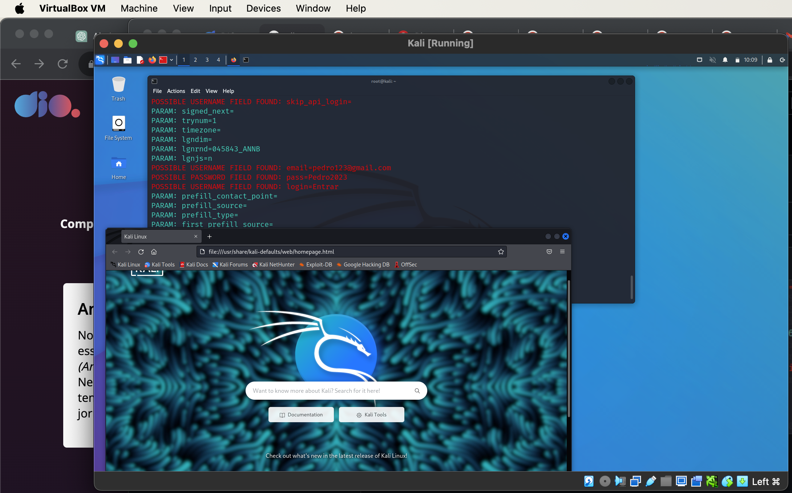

# Phishing para captura de senhas do Facebook

### Ferramentas

- Kali Linux
- setoolkit

### Configurando o Phishing no Kali Linux

- Trocando para o usuário root: ``` sudo su ```
- Iniciando o setoolkit: ``` setoolkit ```
- Selecionando o Tipo de ataque: ``` Social-Engineering Attacks ```
    - Selecionando o Vetor de ataque: ``` Web Site Attack Vectors ```
        - Selecionando o Método de ataque: ```Credential Harvester Attack Method ```
            - Selecionando o Método de ataque: ``` Site Cloner ```
                - Obtendo o endereço IP da máquina: ``` ifconfig ```
                - URL para clone: http://www.facebook.com


### Resutado


